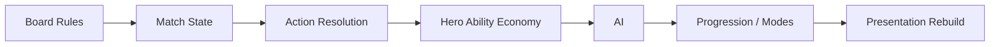
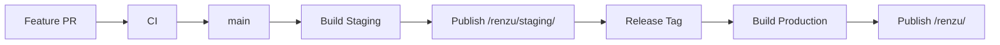

# RENZU Architecture

## Product boundary

RENZU is a standalone hero-based tactical board strategy game. Board decisions remain authoritative; hero systems manipulate board state, action timing, or tactical opportunity rather than replacing the board with a separate HP/ATK combat model.

## Target module map

```text
src/
├─ app/              # bootstrap and application composition
├─ game/
│  ├─ board/         # board representation and line/win rules
│  ├─ match/         # match lifecycle and turn state
│  ├─ action/        # action resolution and timing
│  └─ rules/         # reusable tactical rules
├─ heroes/
│  ├─ domain/
│  ├─ abilities/
│  ├─ economies/
│  └─ content/
├─ ai/
│  ├─ decision/
│  ├─ evaluation/
│  └─ difficulty/
├─ progression/
├─ modes/
├─ presentation/
├─ design-system/
├─ platform/
└─ shared/
```

## Dependency rules

1. `game/` contains pure gameplay rules and must not import PixiJS or browser UI code.
2. `heroes/` may depend on reusable gameplay contracts, but presentation must not be part of hero definitions.
3. `ai/` consumes game/hero state and returns decisions; board rules must not depend on AI.
4. `presentation/` projects application/domain state into PixiJS views and sends intents back through application/runtime boundaries.
5. `platform/` owns storage, analytics, environment, and other browser/service integration.
6. `app/` composes modules and owns bootstrap/navigation orchestration.

## Migration policy

The legacy `gomoku-rpg` implementation is a behavior reference, not a target folder structure. Migration happens incrementally:



For each slice:

- preserve validated gameplay behavior unless explicitly redesigned;
- add characterization tests before or with extraction;
- remove obsolete compatibility glue when the new domain boundary makes it unnecessary;
- do not copy the legacy `main.ts` orchestration model;
- keep the branch buildable and testable.

## Renderer bootstrap contract

The legacy prototype experienced a production blank-screen failure where assets loaded but no canvas was mounted. RENZU therefore keeps these constraints from day one:

- resolve `#app` explicitly;
- renderer initialization has a finite timeout;
- attempt WebGL before WebGPU;
- mount the canvas only after successful initialization;
- emit observable renderer logs;
- render a visible DOM fallback if all renderer attempts fail.

## Hosting contract

RENZU uses GitHub Pages as its production hosting platform, continuing the deployment technology validated by the `gomoku-rpg` prototype.

Because `zeroLR/renzu` is a GitHub Project Pages repository, deployed assets must not assume `/` hosting.

Canonical paths:

- local development: `/`
- production: `/renzu/`
- staging: `/renzu/staging/`

Vite derives its `base` from `RENZU_DEPLOY_TARGET` so staging and production builds emit correct asset URLs.

The deployment infrastructure should preserve both environments in one Pages site rather than treating every deployment as a destructive replacement. This follows the useful part of the legacy playground `pages-state` model while removing its multi-game complexity.

Target site state:

```text
site/
├─ index.html            # production RENZU
├─ assets/               # production assets
└─ staging/
   ├─ index.html         # staging RENZU
   └─ assets/            # staging assets
```

## Release flow



Rules:

1. Pull requests validate tests and production compilation but do not deploy.
2. `main` is the staging source and should remain deployable.
3. A versioned release/tag promotes a tested revision to production.
4. Staging publication must not overwrite production state.
5. Production publication must not remove staging state.
6. GitHub Pages asset paths must be smoke-tested from the deployed URL, not only from local Vite preview.

The actual Pages workflow is implemented as a dedicated infrastructure slice after the standalone foundation is merged.
